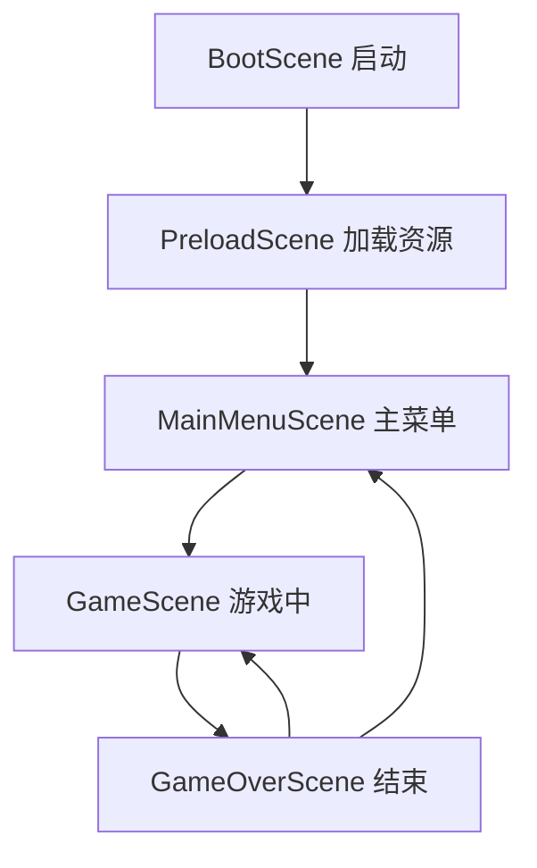

# EasyFly 技术架构文档

## 1. 系统架构总览

### 1.1 架构图
```
┌─────────────────────────────────────────────────────────┐
│                      用户层                              │
│  [PC浏览器]  [iOS Safari]  [Android Chrome]             │
└────────────────────┬────────────────────────────────────┘
                     │ HTTPS
┌────────────────────▼────────────────────────────────────┐
│                   CDN层                                  │
│  [静态资源缓存] [图片/音频] [脚本文件]                   │
└────────────────────┬────────────────────────────────────┘
                     │
┌────────────────────▼────────────────────────────────────┐
│                 前端应用层                               │
│  ┌──────────────┐  ┌──────────────┐  ┌──────────────┐  │
│  │  React层     │  │  Phaser层    │  │  API层       │  │
│  │  UI组件      │  │  游戏引擎    │  │  HTTP请求    │  │
│  │  路由管理    │  │  场景管理    │  │  数据缓存    │  │
│  │  状态管理    │  │  资源加载    │  │  错误处理    │  │
│  └──────────────┘  └──────────────┘  └──────────────┘  │
└────────────────────┬────────────────────────────────────┘
                     │ REST API
┌────────────────────▼────────────────────────────────────┐
│                 后端服务层                               │
│  ┌──────────────┐  ┌──────────────┐  ┌──────────────┐  │
│  │  路由层      │  │  控制器      │  │  中间件      │  │
│  │  API路由     │  │  业务逻辑    │  │  CORS        │  │
│  │  参数验证    │  │  数据处理    │  │  限流        │  │
│  └──────────────┘  └──────────────┘  └──────────────┘  │
└────────────────────┬────────────────────────────────────┘
                     │
┌────────────────────▼────────────────────────────────────┐
│                 数据存储层                               │
│  ┌──────────────┐  ┌──────────────┐                    │
│  │  MongoDB     │  │  Redis       │                     │
│  │  排行榜数据  │  │  缓存        │                     │
│  │  玩家记录    │  │  Session     │                     │
│  └──────────────┘  └──────────────┘                    │
└─────────────────────────────────────────────────────────┘
```

### 1.2 技术栈总览
| 层级 | 技术选型 | 作用 |
|------|---------|------|
| 前端框架 | React 18 + Vite | UI构建与开发 |
| 游戏引擎 | Phaser 3 | 游戏逻辑与渲染 |
| UI框架 | TailwindCSS | 样式管理 |
| 状态管理 | Zustand | 全局状态 |
| 路由 | React Router | 页面路由 |
| HTTP客户端 | Axios | API请求 |
| 后端框架 | Express.js | Web服务 |
| 数据库 | MongoDB | 数据持久化 |
| ODM | Mongoose | 对象模型 |
| 缓存 | Redis (可选) | 性能优化 |
| 部署 | Vercel + Railway | 云端托管 |

## 2. 前端架构设计

### 2.1 目录结构
```
src/
├── main.jsx                 # 应用入口
├── App.jsx                  # 根组件
├── index.css               # 全局样式
│
├── components/             # React组件
│   ├── ui/                # UI组件
│   │   ├── Button.jsx
│   │   ├── Modal.jsx
│   │   └── LoadingSpinner.jsx
│   ├── game/              # 游戏相关组件
│   │   ├── GameCanvas.jsx    # Phaser画布容器
│   │   ├── ScoreDisplay.jsx  # 分数显示
│   │   └── GameControls.jsx  # 游戏控制
│   └── leaderboard/       # 排行榜组件
│       ├── LeaderboardList.jsx
│       └── ScoreSubmitForm.jsx
│
├── scenes/                # Phaser游戏场景
│   ├── BootScene.js       # 启动场景
│   ├── PreloadScene.js    # 资源预加载
│   ├── MainMenuScene.js   # 主菜单
│   ├── GameScene.js       # 游戏主场景
│   └── GameOverScene.js   # 游戏结束
│
├── game/                  # 游戏对象
│   ├── Player.js          # 飞机类
│   ├── Wall.js            # 崖壁类
│   ├── WallManager.js     # 崖壁管理器
│   └── ParticleEffect.js  # 粒子效果
│
├── stores/               # 状态管理
│   ├── gameStore.js      # 游戏状态
│   └── settingsStore.js  # 设置状态
│
├── api/                  # API接口
│   ├── client.js         # Axios实例
│   ├── leaderboard.js    # 排行榜API
│   └── analytics.js      # 数据统计
│
├── utils/                # 工具函数
│   ├── constants.js      # 常量定义
│   ├── helpers.js        # 辅助函数
│   └── storage.js        # 本地存储
│
├── hooks/                # 自定义Hooks
│   ├── useGame.js        # 游戏逻辑Hook
│   ├── useLeaderboard.js # 排行榜Hook
│   └── useSound.js       # 音效Hook
│
└── assets/               # 静态资源
    ├── images/           # 图片
    ├── sounds/           # 音效
    └── fonts/            # 字体
```

### 2.2 Phaser场景设计

#### 2.2.1 场景流程


#### 2.2.2 GameScene核心逻辑
```javascript
// 伪代码示例
class GameScene extends Phaser.Scene {
  create() {
    // 初始化游戏对象
    this.player = new Player(this, 100, 300);
    this.wallManager = new WallManager(this);
    this.score = 0;
    
    // 设置输入
    this.setupInput();
    
    // 开始生成崖壁
    this.wallManager.startSpawning();
  }
  
  update(time, delta) {
    // 更新玩家位置
    this.player.update();
    
    // 更新崖壁
    this.wallManager.update();
    
    // 碰撞检测
    if (this.checkCollision()) {
      this.gameOver();
    }
    
    // 更新分数
    this.updateScore();
  }
}
```

### 2.3 状态管理设计

#### 2.3.1 游戏状态(gameStore)
```javascript
{
  // 游戏状态
  isPlaying: false,
  isPaused: false,
  currentScore: 0,
  highScore: 0,
  
  // 游戏数据
  difficulty: 'normal',
  speed: 200,
  gapHeight: 200,
  
  // 方法
  startGame: () => {},
  pauseGame: () => {},
  endGame: () => {},
  updateScore: (score) => {}
}
```

#### 2.3.2 设置状态(settingsStore)
```javascript
{
  // 音效设置
  soundEnabled: true,
  musicEnabled: true,
  volume: 80,
  
  // 显示设置
  showFPS: false,
  particlesEnabled: true,
  
  // 方法
  toggleSound: () => {},
  setVolume: (value) => {}
}
```

### 2.4 API层设计

#### 2.4.1 API客户端配置
```javascript
// api/client.js
import axios from 'axios';

const apiClient = axios.create({
  baseURL: import.meta.env.VITE_API_URL,
  timeout: 10000,
  headers: {
    'Content-Type': 'application/json'
  }
});

// 请求拦截器
apiClient.interceptors.request.use(
  config => {
    // 添加token等
    return config;
  },
  error => Promise.reject(error)
);

// 响应拦截器
apiClient.interceptors.response.use(
  response => response.data,
  error => {
    // 统一错误处理
    return Promise.reject(error);
  }
);
```

#### 2.4.2 排行榜API封装
```javascript
// api/leaderboard.js
export const leaderboardAPI = {
  // 获取排行榜
  getLeaderboard: () => 
    apiClient.get('/api/leaderboard'),
  
  // 提交分数
  submitScore: (playerName, score) =>
    apiClient.post('/api/leaderboard', { playerName, score }),
  
  // 获取排名
  getRank: (score) =>
    apiClient.get(`/api/rank?score=${score}`)
};
```

## 3. 后端架构设计

### 3.1 后端目录结构
```
server/
├── src/
│   ├── index.js           # 入口文件
│   ├── config/            # 配置
│   │   ├── database.js
│   │   └── env.js
│   ├── models/            # 数据模型
│   │   └── Score.js
│   ├── routes/            # 路由
│   │   └── leaderboard.js
│   ├── controllers/       # 控制器
│   │   └── leaderboardController.js
│   ├── middlewares/       # 中间件
│   │   ├── errorHandler.js
│   │   ├── rateLimiter.js
│   │   └── validator.js
│   └── utils/             # 工具
│       └── logger.js
├── package.json
└── .env
```

### 3.2 数据模型设计

#### 3.2.1 Score模型
```javascript
// models/Score.js
const mongoose = require('mongoose');

const scoreSchema = new mongoose.Schema({
  playerName: {
    type: String,
    required: true,
    trim: true,
    maxlength: 20
  },
  score: {
    type: Number,
    required: true,
    min: 0
  },
  playerId: {
    type: String,
    default: () => uuidv4()
  },
  createdAt: {
    type: Date,
    default: Date.now
  }
}, {
  timestamps: true
});

// 索引
scoreSchema.index({ score: -1 });
scoreSchema.index({ createdAt: -1 });

module.exports = mongoose.model('Score', scoreSchema);
```

### 3.3 API路由设计

```javascript
// routes/leaderboard.js
const express = require('express');
const router = express.Router();
const { 
  getLeaderboard, 
  submitScore, 
  getRank 
} = require('../controllers/leaderboardController');
const { validateScore } = require('../middlewares/validator');
const rateLimiter = require('../middlewares/rateLimiter');

// 获取排行榜 (公开访问)
router.get('/leaderboard', getLeaderboard);

// 提交分数 (限流保护)
router.post('/leaderboard', 
  rateLimiter(10, 60), // 每分钟最多10次
  validateScore,
  submitScore
);

// 获取排名
router.get('/rank', getRank);

module.exports = router;
```

### 3.4 控制器逻辑

```javascript
// controllers/leaderboardController.js
const Score = require('../models/Score');

// 获取Top10排行榜
exports.getLeaderboard = async (req, res) => {
  try {
    const top10 = await Score
      .find()
      .sort({ score: -1 })
      .limit(10)
      .select('playerName score createdAt -_id');
    
    res.json({
      success: true,
      data: top10.map((item, index) => ({
        rank: index + 1,
        ...item.toObject()
      }))
    });
  } catch (error) {
    res.status(500).json({ success: false, error: error.message });
  }
};

// 提交分数
exports.submitScore = async (req, res) => {
  try {
    const { playerName, score } = req.body;
    
    // 创建新记录
    const newScore = await Score.create({ playerName, score });
    
    // 计算排名
    const rank = await Score.countDocuments({ score: { $gt: score } }) + 1;
    
    // 判断是否进入Top10
    const isTop10 = rank <= 10;
    
    res.json({
      success: true,
      rank,
      isTop10,
      message: isTop10 ? '恭喜进入Top10!' : '再接再厉!'
    });
  } catch (error) {
    res.status(500).json({ success: false, error: error.message });
  }
};
```

## 4. 数据库设计

### 4.1 MongoDB集合设计

#### scores集合
```javascript
{
  _id: ObjectId,
  playerName: String,    // 玩家昵称
  score: Number,         // 分数
  playerId: String,      // 玩家ID(UUID)
  createdAt: Date,       // 创建时间
  updatedAt: Date        // 更新时间
}
```

#### 索引策略
```javascript
// 分数降序索引 (排行榜查询)
db.scores.createIndex({ score: -1 })

// 时间索引 (数据清理)
db.scores.createIndex({ createdAt: -1 })

// 复合索引 (分页查询)
db.scores.createIndex({ score: -1, createdAt: -1 })
```

### 4.2 数据优化策略

#### 4.2.1 缓存策略
```javascript
// 使用Redis缓存Top10
const getLeaderboardWithCache = async () => {
  const cacheKey = 'leaderboard:top10';
  
  // 先查缓存
  let data = await redis.get(cacheKey);
  
  if (data) {
    return JSON.parse(data);
  }
  
  // 缓存未命中，查询数据库
  data = await Score.find().sort({ score: -1 }).limit(10);
  
  // 写入缓存，30秒过期
  await redis.setex(cacheKey, 30, JSON.stringify(data));
  
  return data;
};
```

#### 4.2.2 数据清理
```javascript
// 定期清理旧数据，保留Top1000
const cleanOldScores = async () => {
  const threshold = await Score
    .findOne()
    .sort({ score: -1 })
    .skip(999)
    .select('score');
  
  if (threshold) {
    await Score.deleteMany({ 
      score: { $lt: threshold.score },
      createdAt: { $lt: new Date(Date.now() - 30 * 24 * 60 * 60 * 1000) }
    });
  }
};
```

## 5. 性能优化方案

### 5.1 前端优化

#### 5.1.1 资源优化
- 图片使用WebP格式，提供PNG降级
- 压缩JavaScript和CSS
- 启用Gzip/Brotli压缩
- 使用CDN加速静态资源

#### 5.1.2 渲染优化
```javascript
// 使用对象池管理崖壁
class WallPool {
  constructor(scene, size = 10) {
    this.pool = [];
    for (let i = 0; i < size; i++) {
      this.pool.push(new Wall(scene));
    }
  }
  
  acquire() {
    return this.pool.find(w => !w.active) || new Wall(this.scene);
  }
  
  release(wall) {
    wall.reset();
  }
}
```

#### 5.1.3 代码分割
```javascript
// vite.config.js
export default {
  build: {
    rollupOptions: {
      output: {
        manualChunks: {
          'phaser': ['phaser'],
          'react-vendor': ['react', 'react-dom'],
          'ui': ['./src/components/ui']
        }
      }
    }
  }
}
```

### 5.2 后端优化

#### 5.2.1 数据库优化
- 合理使用索引
- 查询结果投影(只返回需要的字段)
- 使用连接池
- 分页查询

#### 5.2.2 API优化
- 启用HTTP缓存头
- 数据压缩(gzip)
- 使用CDN
- 限流保护

### 5.3 移动端优化

```javascript
// 触摸事件优化
const optimizedTouchHandler = (() => {
  let rafId = null;
  let lastY = 0;
  
  return (e) => {
    lastY = e.touches[0].clientY;
    
    if (rafId) return;
    
    rafId = requestAnimationFrame(() => {
      updatePlayerY(lastY);
      rafId = null;
    });
  };
})();
```

## 6. 安全设计

### 6.1 前端安全
- XSS防护: 使用React自动转义
- CSRF防护: Token验证
- 输入验证: 昵称长度、特殊字符过滤

### 6.2 后端安全
```javascript
// 中间件: 速率限制
const rateLimit = require('express-rate-limit');

const limiter = rateLimit({
  windowMs: 60 * 1000, // 1分钟
  max: 10, // 最多10次请求
  message: '请求过于频繁，请稍后再试'
});

// 中间件: 输入验证
const validateScore = (req, res, next) => {
  const { playerName, score } = req.body;
  
  if (!playerName || playerName.length > 20) {
    return res.status(400).json({ error: '昵称无效' });
  }
  
  if (!Number.isInteger(score) || score < 0 || score > 999999) {
    return res.status(400).json({ error: '分数无效' });
  }
  
  next();
};
```

## 7. 部署方案

### 7.1 前端部署(Vercel)

```json
// vercel.json
{
  "buildCommand": "npm run build",
  "outputDirectory": "dist",
  "framework": "vite",
  "routes": [
    { "src": "/assets/(.*)", "dest": "/assets/$1" },
    { "src": "/(.*)", "dest": "/index.html" }
  ]
}
```

### 7.2 后端部署(Railway)

```yaml
# railway.toml
[build]
builder = "NIXPACKS"

[deploy]
startCommand = "npm start"
healthcheckPath = "/health"
restartPolicyType = "ON_FAILURE"
```

### 7.3 环境变量
```bash
# 前端 .env
VITE_API_URL=https://api.easyfly.com
VITE_GA_ID=G-XXXXXXXXXX

# 后端 .env
MONGODB_URI=mongodb+srv://...
PORT=3001
NODE_ENV=production
CORS_ORIGIN=https://easyfly.com
```

## 8. 监控与日志

### 8.1 错误监控
```javascript
// 使用Sentry
import * as Sentry from "@sentry/react";

Sentry.init({
  dsn: "YOUR_SENTRY_DSN",
  environment: process.env.NODE_ENV,
  tracesSampleRate: 1.0,
});
```

### 8.2 性能监控
```javascript
// Web Vitals
import { getCLS, getFID, getFCP, getLCP, getTTFB } from 'web-vitals';

function sendToAnalytics(metric) {
  console.log(metric);
  // 发送到分析服务
}

getCLS(sendToAnalytics);
getFID(sendToAnalytics);
getFCP(sendToAnalytics);
getLCP(sendToAnalytics);
getTTFB(sendToAnalytics);
```

## 9. 测试策略

### 9.1 单元测试
```javascript
// 使用Vitest
import { describe, it, expect } from 'vitest';
import { calculateScore } from './utils/helpers';

describe('calculateScore', () => {
  it('should calculate basic score correctly', () => {
    expect(calculateScore(5, 10)).toBe(60);
  });
});
```

### 9.2 E2E测试
```javascript
// 使用Playwright
import { test, expect } from '@playwright/test';

test('complete game flow', async ({ page }) => {
  await page.goto('/');
  await page.click('text=开始游戏');
  
  // 模拟游戏
  await page.waitForSelector('.game-canvas');
  
  // 验证分数显示
  await expect(page.locator('.score')).toBeVisible();
});
```

## 10. 技术债务管理

### 10.1 代码质量
- ESLint + Prettier代码规范
- Husky + lint-staged提交前检查
- 代码审查流程
- 定期重构

### 10.2 文档维护
- API文档自动生成(Swagger)
- 组件文档(Storybook)
- 架构决策记录(ADR)
- 变更日志(CHANGELOG)
